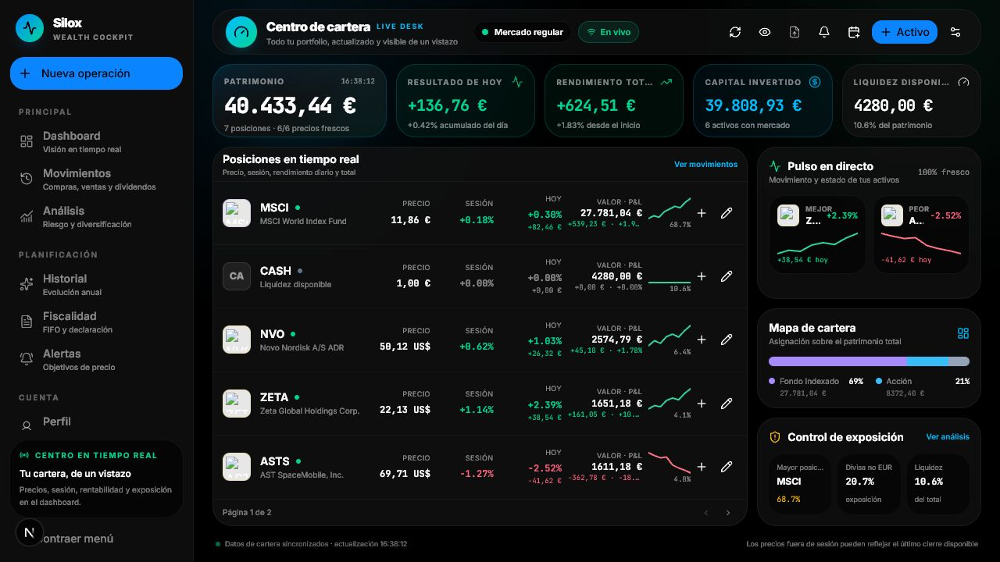
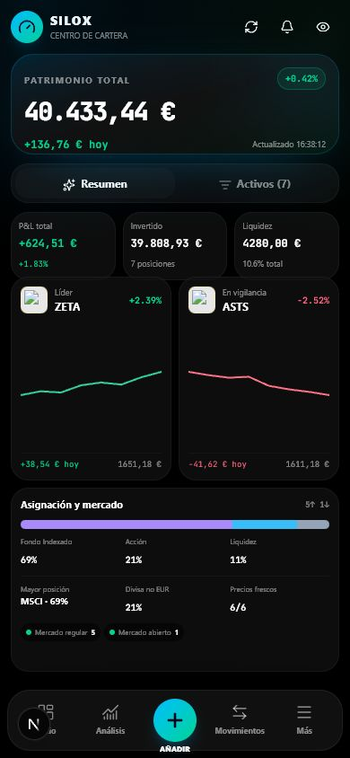
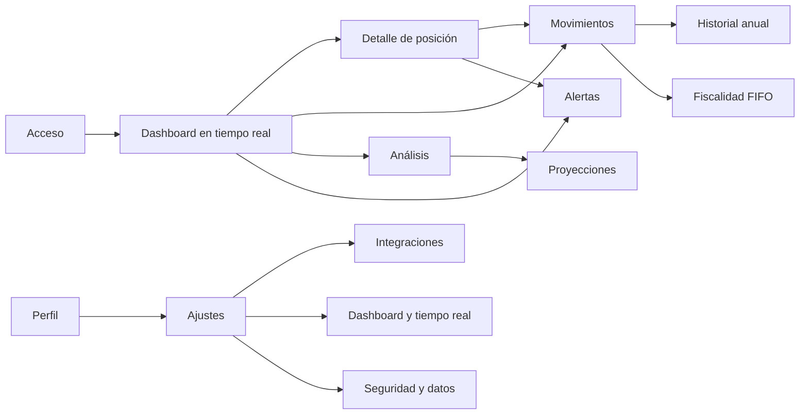

# Silox — sistema de experiencia de inversión

## Principio de producto

El dashboard es el punto de entrada y el centro operativo. Las demás pantallas responden a una de cuatro preguntas: qué tengo, qué ha ocurrido, qué significa y qué debo vigilar. La lógica financiera, los hooks de datos y las acciones existentes se mantienen; el rediseño organiza esas capacidades bajo un sistema visual común.

## Prototipos validados

### Escritorio — 1280 × 720



### Móvil — 390 × 844



Ambos prototipos se han renderizado con datos representativos sobre el componente real del dashboard. No presentan desplazamiento horizontal ni vertical; en móvil, “Resumen” y “Activos” alternan la densidad de información sin perder la navegación principal.

## Arquitectura de navegación



### Navegación de escritorio

- Principal: Dashboard, Movimientos, Análisis.
- Planificación: Historial, Fiscalidad, Alertas.
- Cuenta: Perfil, Ajustes.
- Acción persistente: Nueva operación.
- La navegación puede contraerse para maximizar el espacio de lectura.

### Navegación móvil

- Barra inferior: Inicio, Análisis, Añadir, Movimientos, Más.
- “Más” abre la navegación completa con Historial, Fiscalidad, Alertas, Perfil y Ajustes.
- Todas las funciones web están disponibles; solo cambia la presentación.

## Wireframes funcionales

### 1. Acceso

```text
┌──────────────────────────────┬────────────────────────┐
│ Propuesta de valor           │ Silox                  │
│ • Rendimiento por sesión     │ Google                 │
│ • Seguridad y privacidad     │ ───── o ─────          │
│                              │ Correo / contraseña    │
│                              │ [ Iniciar sesión ]     │
└──────────────────────────────┴────────────────────────┘
```

### 2. Dashboard principal

```text
┌────────────┬──────────────────────────────────────────────────────────┐
│ Navegación │ Estado mercado · En vivo · Buscar · Añadir             │
│            ├──────────┬──────────┬──────────┬──────────┬────────────┤
│ Principal  │Patrimonio│Hoy       │P&L total │Invertido │Liquidez    │
│ Planif.    ├──────────────────────────────────┬──────────────────────┤
│ Cuenta     │ Posiciones en tiempo real        │ Pulso de mercado     │
│            │ logo · precio · hoy · P&L · %    │ Asignación           │
│ + Operación│                                  │ Exposición y riesgo  │
└────────────┴──────────────────────────────────┴──────────────────────┘
```

Propósito: responder en una pantalla cuánto vale la cartera, qué está moviendo el día, cómo se reparte el riesgo y si los datos están frescos.

### 3. Movimientos

```text
┌──────────────────────────────────────────────────────────────────────┐
│ Movimientos                         [Exportar] [Fiscalidad]           │
│ [Buscar activo] [Tipo] [Desde] [Hasta]                               │
├──────────────────────────────────────────────────────────────────────┤
│ Fecha · Activo · Operación · Unidades · Precio · Comisión · Total ⋮ │
└──────────────────────────────────────────────────────────────────────┘
```

Propósito: consultar, filtrar, editar y exportar la contabilidad de la cartera.

### 4. Detalle de posición

```text
┌──────────────────────────────────────────────────────────────────────┐
│ ← Cartera   Logo TICKER · Nombre           [Alerta] [Operación]      │
│ Precio actual · sesión · variación diaria · P&L total                │
├────────────────────────────────────┬─────────────────────────────────┤
│ Gráfico y periodos                 │ Unidades, coste, peso, mercado  │
├────────────────────────────────────┴─────────────────────────────────┤
│ Estadísticas · noticias · operaciones · aportaciones                 │
└──────────────────────────────────────────────────────────────────────┘
```

Propósito: explicar una posición sin perder el contexto de cartera y permitir actuar desde el mismo lugar.

### 5. Análisis y proyecciones

```text
┌──────────────────────────────────────────────────────────────────────┐
│ Análisis de cartera                  [Cartera | Proyecciones]         │
├──────────────────────────────────────────────────────────────────────┤
│ Diversificación · concentración · divisas · sectores · geografía    │
│ Riesgos detectados · escenarios · objetivos y recorrido potencial   │
└──────────────────────────────────────────────────────────────────────┘
```

### 6. Historial anual

```text
┌──────────────────────────────────────────────────────────────────────┐
│ Historial anual                       [Movimientos] [Año 2026 ▾]      │
│ Resumen · aportado · retirado · operaciones                          │
├──────────────────────────────────────────────────────────────────────┤
│ Evolución anual y actividad por mes                                  │
└──────────────────────────────────────────────────────────────────────┘
```

### 7. Fiscalidad

```text
┌──────────────────────────────────────────────────────────────────────┐
│ Asistente de declaración       [Movimientos] [PDF] [Ejercicio ▾]     │
│ Ganancias · pérdidas · resultado neto                                │
├──────────────────────────────────────────────────────────────────────┤
│ Acciones · fondos · cripto · dividendos · retenciones                │
│ Guía fiscal y asistente contextual                                   │
└──────────────────────────────────────────────────────────────────────┘
```

### 8. Alertas

```text
┌────────────────────────────┬─────────────────────────────────────────┐
│ Activas · activos · hechas │ Centro de alertas                      │
│ Nueva alerta               │ [Activas | Cumplidas | Todas]          │
│ Activo / condición / precio│ Logo · ticker · objetivo · distancia   │
│ [ Activar alerta ]         │ precio actual · estado · eliminar      │
└────────────────────────────┴─────────────────────────────────────────┘
```

Nueva capacidad: vista independiente para gestionar objetivos, distancia al precio y señales cumplidas; el mismo módulo se reutiliza en el panel lateral del dashboard.

### 9. Perfil

```text
┌──────────────────────────────────────────────────────────────────────┐
│ Perfil personal                         [Ajustes avanzados]           │
│ Apariencia · privacidad · experiencia · cuenta                       │
└──────────────────────────────────────────────────────────────────────┘
```

### 10. Ajustes

```text
┌───────────────────┬──────────────────────────────────────────────────┐
│ Apariencia        │ Preferencias del grupo seleccionado             │
│ Seguridad         │ filas claras, descripción y control             │
│ Notificaciones    │                                                  │
│ Integraciones     │ importación Revolut / MyInvestor                │
│ Datos             │ exportación, privacidad y zona peligrosa        │
└───────────────────┴──────────────────────────────────────────────────┘
```

En móvil, las categorías se convierten en una banda horizontal y conservan todas las opciones del escritorio.

## Sistema visual

- Base neutral oscura o clara mediante tokens; un único color primario personalizable.
- Verde y rojo reservados para significado financiero, no para decoración.
- Inter para interfaz y JetBrains Mono para precios, porcentajes y horas.
- Radios consistentes de 12–16 px, superficies con un solo nivel de borde y sombras contenidas.
- Objetivos táctiles mínimos de 44 px, foco visible, títulos únicos y navegación semántica.
- Densidad compacta en datos y cómoda en formularios, configuración y estados vacíos.

## Compatibilidad con la arquitectura

- App Router: el layout compartido conserva navegación y estado entre rutas.
- React Query y Supabase: no se cambia la fuente de verdad ni el modelo de datos.
- Zustand: se reutilizan preferencias, menú contraído, privacidad y acción rápida.
- Los componentes de alertas, encabezados y navegación son compartidos y reutilizables.
- Las páginas existentes conservan sus cálculos, formularios, importadores y acciones.
